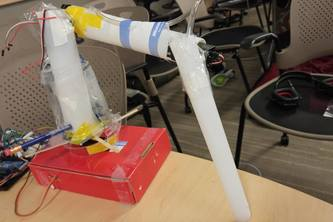

# BaseHacks

### Description

A robotic arm that creates sandwiches. It can be controlled via Amazon Alexa, a web browser, or through the push of a button on the physical arm. Please ignore the swear words on our commit messages. We were at a hackathon programming for 24-hours straight with no breaks. We were overwhelmed with joy when it worked.

[Demo](https://www.youtube.com/watch?v=eY7B8Lo3ex4)

### How it works

The robotic arm is hacked together using generous amounts of tape. There is a servo at the base. There is a broken lightsaber part taped onto the base servo. That lightsaber part is connected to another servo which is connected to another broken part of that lightsaber. We used tape to secure all of that. At this point, we ran out of tape. We had to use stickers... Anyways, we had one last servo motor so we connected that with a broken lightsaber piece onto the rest of the contraption. And we used stickers to hold it together. We forced the vacuum motor inside of a broken lightsaber piece. However, our relay apparently didn't work and our vacuum motor accepts 12V when the Arduino only outputs 5V. Thankfully, we had a 12V battery. We stickered jumper wires onto the ends of the battery and attached it to a button. We also placed a mini servo onto the breadboard which pushed the button whenever we need the suction motor turned on. It's incredibly hacky but it worked. After the hardware components were finished, we had to create a UI for people to tell the contraption to create them a sandwich. You can now use Alexa to create a sandwich. You can also visit the localhost website to create a website as well. Actually, anyone can make a UI for it because all you have to do to make a sandwich is send a GET request to the Node.js server.

Contributors:

Devin Mui - Backend Developer

Jaiveer Singh - Hardware Developer

Jesse Liang - Frontend Developer
